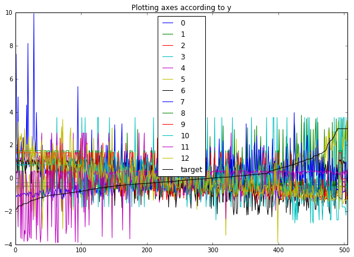
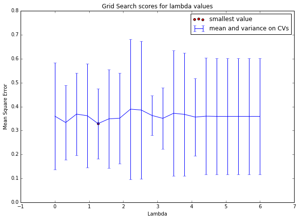

# BostonHousePricesRegression

Linear regressions (normal, lasso, l2, etc) on sklearn's Boston house prices dataset.

# TP2:  FDMS  Régularisation $L_1(\theta)$, $L_2(\theta)$, $\lambda L_1(\theta) + \lambda L_2(\theta)$
### de Bézenac Emmanuel


```python
import numpy as np
import matplotlib.pyplot as plt
%matplotlib inline
```

## Data : Boston House Prices dataset
### loading


```python
from sklearn import datasets
boston = datasets.load_boston()
features = np.array(['ZN', 'INDUS', 'CHAS', 'NOX', 'RM', 'AGE', 'DIS', 'RAD', 'TAX', 'PTRATIO', 'B', 'LSTAT', 'MEDV'])
print boston.DESCR
```

    Boston House Prices dataset
    
    Notes
    ------
    Data Set Characteristics:  
    
        :Number of Instances: 506 
    
        :Number of Attributes: 13 numeric/categorical predictive
        
        :Median Value (attribute 14) is usually the target
    
        :Attribute Information (in order):
            - CRIM     per capita crime rate by town
            - ZN       proportion of residential land zoned for lots over 25,000 sq.ft.
            - INDUS    proportion of non-retail business acres per town
            - CHAS     Charles River dummy variable (= 1 if tract bounds river; 0 otherwise)
            - NOX      nitric oxides concentration (parts per 10 million)
            - RM       average number of rooms per dwelling
            - AGE      proportion of owner-occupied units built prior to 1940
            - DIS      weighted distances to five Boston employment centres
            - RAD      index of accessibility to radial highways
            - TAX      full-value property-tax rate per $10,000
            - PTRATIO  pupil-teacher ratio by town
            - B        1000(Bk - 0.63)^2 where Bk is the proportion of blacks by town
            - LSTAT    % lower status of the population
            - MEDV     Median value of owner-occupied homes in $1000's
    
        :Missing Attribute Values: None
    
        :Creator: Harrison, D. and Rubinfeld, D.L.
    
    This is a copy of UCI ML housing dataset.
    http://archive.ics.uci.edu/ml/datasets/Housing
    
    
    This dataset was taken from the StatLib library which is maintained at Carnegie Mellon University.
    
    The Boston house-price data of Harrison, D. and Rubinfeld, D.L. 'Hedonic
    prices and the demand for clean air', J. Environ. Economics & Management,
    vol.5, 81-102, 1978.   Used in Belsley, Kuh & Welsch, 'Regression diagnostics
    ...', Wiley, 1980.   N.B. Various transformations are used in the table on
    pages 244-261 of the latter.
    
    The Boston house-price data has been used in many machine learning papers that address regression
    problems.   
         
    **References**
    
       - Belsley, Kuh & Welsch, 'Regression diagnostics: Identifying Influential Data and Sources of Collinearity', Wiley, 1980. 244-261.
       - Quinlan,R. (1993). Combining Instance-Based and Model-Based Learning. In Proceedings on the Tenth International Conference of Machine Learning, 236-243, University of Massachusetts, Amherst. Morgan Kaufmann.
       - many more! (see http://archive.ics.uci.edu/ml/datasets/Housing)
    


### analysis


```python
import pandas as pd
d_data = pd.DataFrame(boston.data)
d_data.describe()
```


<div>
<table border="1" class="dataframe">
  <thead>
    <tr style="text-align: right;">
      <th></th>
      <th>0</th>
      <th>1</th>
      <th>2</th>
      <th>3</th>
      <th>4</th>
      <th>5</th>
      <th>6</th>
      <th>7</th>
      <th>8</th>
      <th>9</th>
      <th>10</th>
      <th>11</th>
      <th>12</th>
    </tr>
  </thead>
  <tbody>
    <tr>
      <th>count</th>
      <td>506.000000</td>
      <td>506.000000</td>
      <td>506.000000</td>
      <td>506.000000</td>
      <td>506.000000</td>
      <td>506.000000</td>
      <td>506.000000</td>
      <td>506.000000</td>
      <td>506.000000</td>
      <td>506.000000</td>
      <td>506.000000</td>
      <td>506.000000</td>
      <td>506.000000</td>
    </tr>
    <tr>
      <th>mean</th>
      <td>3.593761</td>
      <td>11.363636</td>
      <td>11.136779</td>
      <td>0.069170</td>
      <td>0.554695</td>
      <td>6.284634</td>
      <td>68.574901</td>
      <td>3.795043</td>
      <td>9.549407</td>
      <td>408.237154</td>
      <td>18.455534</td>
      <td>356.674032</td>
      <td>12.653063</td>
    </tr>
    <tr>
      <th>std</th>
      <td>8.596783</td>
      <td>23.322453</td>
      <td>6.860353</td>
      <td>0.253994</td>
      <td>0.115878</td>
      <td>0.702617</td>
      <td>28.148861</td>
      <td>2.105710</td>
      <td>8.707259</td>
      <td>168.537116</td>
      <td>2.164946</td>
      <td>91.294864</td>
      <td>7.141062</td>
    </tr>
    <tr>
      <th>min</th>
      <td>0.006320</td>
      <td>0.000000</td>
      <td>0.460000</td>
      <td>0.000000</td>
      <td>0.385000</td>
      <td>3.561000</td>
      <td>2.900000</td>
      <td>1.129600</td>
      <td>1.000000</td>
      <td>187.000000</td>
      <td>12.600000</td>
      <td>0.320000</td>
      <td>1.730000</td>
    </tr>
    <tr>
      <th>25%</th>
      <td>0.082045</td>
      <td>0.000000</td>
      <td>5.190000</td>
      <td>0.000000</td>
      <td>0.449000</td>
      <td>5.885500</td>
      <td>45.025000</td>
      <td>2.100175</td>
      <td>4.000000</td>
      <td>279.000000</td>
      <td>17.400000</td>
      <td>375.377500</td>
      <td>6.950000</td>
    </tr>
    <tr>
      <th>50%</th>
      <td>0.256510</td>
      <td>0.000000</td>
      <td>9.690000</td>
      <td>0.000000</td>
      <td>0.538000</td>
      <td>6.208500</td>
      <td>77.500000</td>
      <td>3.207450</td>
      <td>5.000000</td>
      <td>330.000000</td>
      <td>19.050000</td>
      <td>391.440000</td>
      <td>11.360000</td>
    </tr>
    <tr>
      <th>75%</th>
      <td>3.647423</td>
      <td>12.500000</td>
      <td>18.100000</td>
      <td>0.000000</td>
      <td>0.624000</td>
      <td>6.623500</td>
      <td>94.075000</td>
      <td>5.188425</td>
      <td>24.000000</td>
      <td>666.000000</td>
      <td>20.200000</td>
      <td>396.225000</td>
      <td>16.955000</td>
    </tr>
    <tr>
      <th>max</th>
      <td>88.976200</td>
      <td>100.000000</td>
      <td>27.740000</td>
      <td>1.000000</td>
      <td>0.871000</td>
      <td>8.780000</td>
      <td>100.000000</td>
      <td>12.126500</td>
      <td>24.000000</td>
      <td>711.000000</td>
      <td>22.000000</td>
      <td>396.900000</td>
      <td>37.970000</td>
    </tr>
  </tbody>
</table>
</div>


```python
d_target = pd.DataFrame(boston.target)
d_target.describe()
```


<div>
<table border="1" class="dataframe">
  <thead>
    <tr style="text-align: right;">
      <th></th>
      <th>0</th>
    </tr>
  </thead>
  <tbody>
    <tr>
      <th>count</th>
      <td>506.000000</td>
    </tr>
    <tr>
      <th>mean</th>
      <td>22.532806</td>
    </tr>
    <tr>
      <th>std</th>
      <td>9.197104</td>
    </tr>
    <tr>
      <th>min</th>
      <td>5.000000</td>
    </tr>
    <tr>
      <th>25%</th>
      <td>17.025000</td>
    </tr>
    <tr>
      <th>50%</th>
      <td>21.200000</td>
    </tr>
    <tr>
      <th>75%</th>
      <td>25.000000</td>
    </tr>
    <tr>
      <th>max</th>
      <td>50.000000</td>
    </tr>
  </tbody>
</table>
</div>


### preprocessing 


```python
#renormalizing
X = boston.data
y = boston.target
X = (X-X.mean(axis=0))/X.std(axis=0)
y = (y-y.mean())/y.std()
pd.DataFrame(X).describe()
#pd.DataFrame(y).describe()
```


<div>
<table border="1" class="dataframe">
  <thead>
    <tr style="text-align: right;">
      <th></th>
      <th>0</th>
      <th>1</th>
      <th>2</th>
      <th>3</th>
      <th>4</th>
      <th>5</th>
      <th>6</th>
      <th>7</th>
      <th>8</th>
      <th>9</th>
      <th>10</th>
      <th>11</th>
      <th>12</th>
    </tr>
  </thead>
  <tbody>
    <tr>
      <th>count</th>
      <td>5.060000e+02</td>
      <td>5.060000e+02</td>
      <td>5.060000e+02</td>
      <td>5.060000e+02</td>
      <td>5.060000e+02</td>
      <td>5.060000e+02</td>
      <td>5.060000e+02</td>
      <td>5.060000e+02</td>
      <td>5.060000e+02</td>
      <td>5.060000e+02</td>
      <td>5.060000e+02</td>
      <td>5.060000e+02</td>
      <td>5.060000e+02</td>
    </tr>
    <tr>
      <th>mean</th>
      <td>6.340997e-17</td>
      <td>-6.343191e-16</td>
      <td>-2.682911e-15</td>
      <td>4.701992e-16</td>
      <td>2.490322e-15</td>
      <td>-1.145230e-14</td>
      <td>-1.407855e-15</td>
      <td>9.210902e-16</td>
      <td>5.441409e-16</td>
      <td>-8.868619e-16</td>
      <td>-9.205636e-15</td>
      <td>8.163101e-15</td>
      <td>-3.370163e-16</td>
    </tr>
    <tr>
      <th>std</th>
      <td>1.000990e+00</td>
      <td>1.000990e+00</td>
      <td>1.000990e+00</td>
      <td>1.000990e+00</td>
      <td>1.000990e+00</td>
      <td>1.000990e+00</td>
      <td>1.000990e+00</td>
      <td>1.000990e+00</td>
      <td>1.000990e+00</td>
      <td>1.000990e+00</td>
      <td>1.000990e+00</td>
      <td>1.000990e+00</td>
      <td>1.000990e+00</td>
    </tr>
    <tr>
      <th>min</th>
      <td>-4.177134e-01</td>
      <td>-4.877224e-01</td>
      <td>-1.557842e+00</td>
      <td>-2.725986e-01</td>
      <td>-1.465882e+00</td>
      <td>-3.880249e+00</td>
      <td>-2.335437e+00</td>
      <td>-1.267069e+00</td>
      <td>-9.828429e-01</td>
      <td>-1.313990e+00</td>
      <td>-2.707379e+00</td>
      <td>-3.907193e+00</td>
      <td>-1.531127e+00</td>
    </tr>
    <tr>
      <th>25%</th>
      <td>-4.088961e-01</td>
      <td>-4.877224e-01</td>
      <td>-8.676906e-01</td>
      <td>-2.725986e-01</td>
      <td>-9.130288e-01</td>
      <td>-5.686303e-01</td>
      <td>-8.374480e-01</td>
      <td>-8.056878e-01</td>
      <td>-6.379618e-01</td>
      <td>-7.675760e-01</td>
      <td>-4.880391e-01</td>
      <td>2.050715e-01</td>
      <td>-7.994200e-01</td>
    </tr>
    <tr>
      <th>50%</th>
      <td>-3.885818e-01</td>
      <td>-4.877224e-01</td>
      <td>-2.110985e-01</td>
      <td>-2.725986e-01</td>
      <td>-1.442174e-01</td>
      <td>-1.084655e-01</td>
      <td>3.173816e-01</td>
      <td>-2.793234e-01</td>
      <td>-5.230014e-01</td>
      <td>-4.646726e-01</td>
      <td>2.748590e-01</td>
      <td>3.811865e-01</td>
      <td>-1.812536e-01</td>
    </tr>
    <tr>
      <th>75%</th>
      <td>6.248255e-03</td>
      <td>4.877224e-02</td>
      <td>1.015999e+00</td>
      <td>-2.725986e-01</td>
      <td>5.986790e-01</td>
      <td>4.827678e-01</td>
      <td>9.067981e-01</td>
      <td>6.623709e-01</td>
      <td>1.661245e+00</td>
      <td>1.530926e+00</td>
      <td>8.065758e-01</td>
      <td>4.336510e-01</td>
      <td>6.030188e-01</td>
    </tr>
    <tr>
      <th>max</th>
      <td>9.941735e+00</td>
      <td>3.804234e+00</td>
      <td>2.422565e+00</td>
      <td>3.668398e+00</td>
      <td>2.732346e+00</td>
      <td>3.555044e+00</td>
      <td>1.117494e+00</td>
      <td>3.960518e+00</td>
      <td>1.661245e+00</td>
      <td>1.798194e+00</td>
      <td>1.638828e+00</td>
      <td>4.410519e-01</td>
      <td>3.548771e+00</td>
    </tr>
  </tbody>
</table>
</div>


```python
df = pd.DataFrame(X, columns=range(X.shape[1]))
df['target'] = y
df.sort_values('target').reset_index(drop=True).plot(title='Plotting axes according to y', figsize=(10,7))
```


    <matplotlib.axes._subplots.AxesSubplot at 0x7fa0043347d0>





## Abstract model class


```python
from sklearn.base import BaseEstimator

class Regressor(BaseEstimator):
    def __init__(self):
        print('initialiasing...')
        
    def fit(self, X, y):
        print('fitting...')
        
    def predict(self, X):
        print("predicting...")
        
    def score(self, X, y, metric = 'mean_square_error'):
        y_hat = self.f(X)
        if metric == 'mean_square_error':
            return np.mean((y-y_hat)**2)
        if metric == 'linear_correlation': #computes pearson linear correlation            
            return np.sum((y_hat-y_hat.mean())*(y-y.mean()))/(np.sum((y_hat-y_hat.mean())**2)*np.sum((y-y.mean())**2))        
        if metric == 'coeff_determination': #compute coefficient of determination
            return 1-np.sum((y_hat-y)**2)/np.sum((y-y.mean())**2)
        return None
```

## Simple Linear Regressor


```python
class LinearRegressor(Regressor):
    def __init__(self, max_iter=5, eps=1e-3, print_every=1):

        self.max_iter = max_iter
        self.eps = eps
        self.print_every = print_every
        self.W = np.random.randn(X.shape[1])
    
    def fit(self, X, y):
        for epoch in xrange(self.max_iter):
            
            if self.print_every != -1 and epoch%self.print_every == 0:
                print('epoch = '+str(epoch)+', loss = '+str(self.score(X, y)))
            
            #parameter update
            self.W -= self.eps*self.grad(X, y)
        if self.print_every != -1:
            print('epoch = '+str(epoch+1)+', loss = '+str(self.score(X, y)))
        
    def predict(self, X):
        return self.f(X)
    
    def f(self, X):
        return X.dot(self.W)
    
    def grad(self, X, y):
        n = X.shape[0]
        return (-2./n)*X.T.dot(y-self.f(X))

```


```python
r = LinearRegressor(print_every=100, max_iter=400, eps=1e-2)
r.fit(X, y)
```

    epoch = 0, loss = 10.7765546572
    epoch = 100, loss = 0.90360254079
    epoch = 200, loss = 0.512167850869
    epoch = 300, loss = 0.422674347769
    epoch = 400, loss = 0.376734319367


## $L_1(\theta)$ Linear Regressor


```python
class SparseLinearRegressor(LinearRegressor):
    
    def __init__(self, max_iter=100, eps=1e-3, lam=1e-3, regularize_every=1, print_every=-1):
        self.max_iter = max_iter
        self.print_every = print_every
        self.eps = eps
        self.regularize_every = regularize_every
        self.lam = lam
        self.W = np.random.randn(X.shape[1])

    def reg_grad(self):
        return self.lam*(np.array(self.W>0, dtype=float) - np.array(self.W<0, dtype=float))
    

    def fit(self, X, y):
        
        for epoch in xrange(self.max_iter):
            
            #evaluating
            if self.print_every != -1 and epoch%self.print_every == 0:
                print('epoch = '+str(epoch)+', loss = '+str(self.score(X, y))\
                    +',  params_norm = '+str(np.sum(np.abs(self.W)))\
                    +', null_params = '+str((self.W==0).sum()))
            
            # normal parameter update
            self.W = self.W - self.eps*self.grad(X, y)
            
            #parameter update for regularizer
            if epoch%self.regularize_every == 0:
                nW = self.W - self.eps*self.reg_grad()
                nW[self.W*nW<0] = 0 #gradient clipping
                self.W = nW
        
        if self.print_every != -1:
            print('epoch = '+str(epoch+1)+', loss = '+str(self.score(X, y))\
                +',  params_norm = '+str(np.sum(np.abs(self.W)))\
                +', null_params = '+str((self.W==0).sum()))
```

### fitting


```python
sr = SparseLinearRegressor(eps=1e-2, regularize_every=1, print_every=100, max_iter = 400, lam=.01)
sr.fit(X, y)
```

    epoch = 0, loss = 3.69126558027,  params_norm = 6.75918440128, null_params = 0
    epoch = 100, loss = 0.705512258433,  params_norm = 3.48050919861, null_params = 0
    epoch = 200, loss = 0.43287320925,  params_norm = 2.56384598471, null_params = 0
    epoch = 300, loss = 0.338988821193,  params_norm = 2.0225374827, null_params = 0
    epoch = 400, loss = 0.298131685772,  params_norm = 1.91602541983, null_params = 0


### cross-validation


```python
from sklearn.metrics import mean_squared_error, make_scorer
from sklearn import cross_validation

mse = make_scorer(mean_squared_error, greater_is_better=True)
sr = SparseLinearRegressor(eps=1e-2, regularize_every=1, print_every=-1, max_iter = 400, lam=.01)
cross_validation.cross_val_score(sr, X, y, cv=5, scoring=mse)
```


    array([ 0.18018479,  0.34928205,  0.62501478,  1.21498443,  0.30419979])


### printing various metrics and feature weights


```python
sr = SparseLinearRegressor(eps=5e-2, regularize_every=1, print_every=-1, max_iter = 2000, lam=1e-2)
sr.fit(X, y)
x = sr.predict(X)

print ''
print 'mean square error : '
print sr.score(X, y, metric='mean_square_error')
print 'pearson linear correlation :'
print sr.score(X, y, metric='linear_correlation')
print 'coefficient of determination :'
print sr.score(X, y, metric='coeff_determination')

print '\nfeature weights and associated values:'
print np.abs(sr.W).argsort()[::-1]
print features[np.abs(sr.W).argsort()[::-1]]
print sr.W[np.abs(sr.W).argsort()[::-1]]
```

    
    mean square error : 
    0.260565932531
    pearson linear correlation :
    0.00200575810709
    coefficient of determination :
    0.739434067469
    
    feature weights and associated values:
    [12  7  5 10  8  4  9  1 11  0  3  6  2]
    ['MEDV' 'RAD' 'AGE' 'B' 'TAX' 'RM' 'PTRATIO' 'INDUS' 'LSTAT' 'ZN' 'NOX'
     'DIS' 'CHAS']
    [-0.40606789 -0.30598877  0.29798833 -0.2166986   0.21276367 -0.19728562
     -0.15883986  0.09818023  0.08866458 -0.08563966  0.07352941  0.          0.        ]


### Grid Search


```python
from sklearn.grid_search import GridSearchCV

parameter_grid = {
    'eps':[1e-1, 1e-2, 1e-3],
    'max_iter':[200, 400, 800],#, 1200],
    'regularize_every':range(1, 20, 1),
    'lam':np.linspace(0, 6, 20),
}

grid_search = GridSearchCV(SparseLinearRegressor(print_every=-1), parameter_grid, cv=5, n_jobs=-1)
grid_search.fit(X, y)
```


    GridSearchCV(cv=5, error_score='raise',
           estimator=SparseLinearRegressor(eps=0.001, lam=0.001, max_iter=100, print_every=-1,
               regularize_every=1),
           fit_params={}, iid=True, n_jobs=-1,
           param_grid={'lam': array([ 0.     ,  0.31579,  0.63158,  0.94737,  1.26316,  1.57895,
            1.89474,  2.21053,  2.52632,  2.84211,  3.15789,  3.47368,
            3.78947,  4.10526,  4.42105,  4.73684,  5.05263,  5.36842,
            5.68421,  6.     ]), 'regularize_every': [1, 2, 3, 4, 5, 6, 7, 8, 9, 10, 11, 12, 13, 14, 15, 16, 17, 18, 19], 'max_iter': [200, 400, 800], 'eps': [0.1, 0.01, 0.001]},
           pre_dispatch='2*n_jobs', refit=True, scoring=None, verbose=0)


```python
def project_grid_scores(grid_scores, axis='lam'):
    # groups scores according to axis and aggregates
    # the the values according to a minima pooling
    best = {}
    for s in grid_scores:
        axis_value = s[0][axis]
        if axis_value not in best:
            best[axis_value] = s
        elif best[axis_value].mean_validation_score > s.mean_validation_score :
            best[axis_value] = s
    return best.values()
```


```python
results = project_grid_scores(grid_search.grid_scores_)
results = sorted(results, key=lambda x:x[0]['lam'])

mean = np.array([r[1] for r in results])
std = np.array([r[2].std() for r in results])

print 'best parameters:'
print results[mean.argmin()]

#plotting
plt.figure(figsize=(10, 7))
plt.title('Grid Search scores for lambda values')
p_x = grid_search.param_grid['lam']
p_y = mean
p_y_err = std
plt.errorbar(p_x, p_y, p_y_err, label='mean and variance on CVs')
plt.scatter([p_x[p_y.argmin()]], p_y.min(), c='r', label='smallest value')
plt.xlabel('Lambda')
plt.ylabel('Mean Square Error')
plt.legend()
```

    best parameters:
    mean: 0.32888, std: 0.14650, params: {'lam': 1.263157894736842, 'regularize_every': 5, 'max_iter': 200, 'eps': 0.01}


    <matplotlib.legend.Legend at 0x7fa0040e8e90>





## $L_2(\theta)$ Regressor


```python
class L2LinearRegressor(SparseLinearRegressor):
    
    def reg_grad(self):
        return -self.lam*self.W
```

## $\lambda_1 L_1(\theta)+ \lambda_2 L_2(\theta)$ Regressor


```python
class L1L2LinearRegressor(SparseLinearRegressor):
    
    def reg_grad(self):
        l1_grad = np.array(self.W>0, dtype=float) - np.array(self.W<0, dtype=float)
        l2_grad = -self.W
        return self.lam[0]*l1_grad + self.lam[1]*l2_grad
```

## Tests


```python
print 'L1 regressor'
slr = SparseLinearRegressor(max_iter=1000, print_every=100, lam=1)
print slr.get_params()
slr.fit(X, y)

print ''
print 'L2 regressor'
l2lr = L2LinearRegressor(max_iter=1000, print_every=100, lam=1)
print l2lr.get_params()
l2lr.fit(X, y)

print ''
print 'L1 L2 regressor'
l1l2lr = L1L2LinearRegressor(max_iter=1000, print_every=100, lam=(.5, .5))
print l1l2lr.get_params()
l1l2lr.fit(X, y)

from sklearn import linear_model
lasso = linear_model.Lasso(alpha=.5, tol=1, max_iter=1000)
lasso.fit(X, y)

print ''
print 'coefficient of determination (r2_score)'
print slr.score(X, y, metric='coeff_determination')
print l2lr.score(X, y, metric='coeff_determination')
print l1l2lr.score(X, y, metric='coeff_determination')
print lasso.score(X, y)
```

    L1 regressor
    {'regularize_every': 1, 'lam': 1, 'print_every': 100, 'max_iter': 1000, 'eps': 0.001}
    epoch = 0, loss = 10.4976748746,  params_norm = 8.89135712665, null_params = 0
    epoch = 100, loss = 3.00664741505,  params_norm = 6.4652748831, null_params = 0
    epoch = 200, loss = 1.572590749,  params_norm = 4.77751426051, null_params = 2
    epoch = 300, loss = 0.908042316743,  params_norm = 3.35552583666, null_params = 3
    epoch = 400, loss = 0.575268962384,  params_norm = 2.17437584962, null_params = 4
    epoch = 500, loss = 0.443753419843,  params_norm = 1.29733257248, null_params = 6
    epoch = 600, loss = 0.436603161078,  params_norm = 0.80540613886, null_params = 9
    epoch = 700, loss = 0.487833190979,  params_norm = 0.55019987582, null_params = 10
    epoch = 800, loss = 0.546617031592,  params_norm = 0.437765463372, null_params = 11
    epoch = 900, loss = 0.588902073094,  params_norm = 0.375425917752, null_params = 11
    epoch = 1000, loss = 0.624572047154,  params_norm = 0.328083397996, null_params = 11
    
    L2 regressor
    {'regularize_every': 1, 'lam': 1, 'print_every': 100, 'max_iter': 1000, 'eps': 0.001}
    epoch = 0, loss = 16.5251701495,  params_norm = 16.7405060669, null_params = 0
    epoch = 100, loss = 15.1563791897,  params_norm = 16.4207048302, null_params = 0
    epoch = 200, loss = 14.1789540695,  params_norm = 16.2744915702, null_params = 0
    epoch = 300, loss = 13.4262822109,  params_norm = 16.1883706236, null_params = 0
    epoch = 400, loss = 12.8514064218,  params_norm = 16.1294963535, null_params = 0
    epoch = 500, loss = 12.4264788449,  params_norm = 16.1003485888, null_params = 0
    epoch = 600, loss = 12.1314301175,  params_norm = 16.1011711113, null_params = 0
    epoch = 700, loss = 11.9516221015,  params_norm = 16.1371004961, null_params = 0
    epoch = 800, loss = 11.8766032184,  params_norm = 16.2107493339, null_params = 0
    epoch = 900, loss = 11.8992186982,  params_norm = 16.3104305712, null_params = 0
    epoch = 1000, loss = 12.014968423,  params_norm = 16.4363200169, null_params = 0
    
    L1 L2 regressor
    {'regularize_every': 1, 'lam': (0.5, 0.5), 'print_every': 100, 'max_iter': 1000, 'eps': 0.001}
    epoch = 0, loss = 23.6497140091,  params_norm = 12.4025150996, null_params = 0
    epoch = 100, loss = 7.77591824659,  params_norm = 9.37008722638, null_params = 0
    epoch = 200, loss = 4.47358767143,  params_norm = 7.73065969542, null_params = 0
    epoch = 300, loss = 2.98113982244,  params_norm = 6.57238574609, null_params = 0
    epoch = 400, loss = 2.0652097558,  params_norm = 5.58334816328, null_params = 1
    epoch = 500, loss = 1.49495123498,  params_norm = 4.79510748441, null_params = 3
    epoch = 600, loss = 1.15217358156,  params_norm = 4.19752862579, null_params = 4
    epoch = 700, loss = 0.935060186232,  params_norm = 3.68541527166, null_params = 4
    epoch = 800, loss = 0.794779261144,  params_norm = 3.25094218096, null_params = 5
    epoch = 900, loss = 0.709291619932,  params_norm = 2.92318617945, null_params = 6
    epoch = 1000, loss = 0.652876390964,  params_norm = 2.66330459643, null_params = 6
    
    coefficient of determination (r2_score)
    0.375427952846
    -11.014968423
    0.347123609036
    0.344419164273


Lorsque l'on utilise le modèle de régression sparse simple, l'on a beaucoup de valeurs nulles, l'on peut observer une norme des paramètres qui est faible. Lorsque que l'on rajoute un terme pour maximiser la norme l2, le la norme devient évidemment plus grande (d'autant plus qu'il peut être enclain à surraprendre), mais le MSE également. Un bon compromis est le troisième modèle, qui essaye de trouver une expliquation sparse des données, tout en rectifiant le coup pour éviter que toutes les valeurs des paramètres soient nulles.


